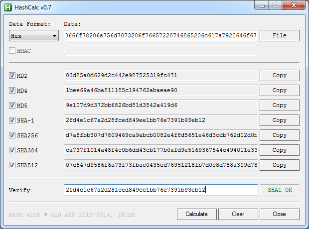

# HashCalc by jNizM
Calculate hash from string or file via AutoHotkey

## Features
* Generate hash value from string or file
* Secure-Salted function
* Verify hash

### Hash Functions
* MD2 (+ HMAC)
* MD4 (+ HMAC)
* MD5 (+ HMAC)
* SHA-1 (+ HMAC)
* SHA-256 (+ HMAC)
* SHA-384 (+ HMAC)
* SHA-512 (+ HMAC)

## Screenshot

## Info
* Version: v0.6
* URL: [AHK Thread](http://ahkscript.org/boards/viewtopic.php?f=6&t=87)

## Changelog
* 0.6 | Change Salt to HMAC funtion
* 0.5 | Added Drag&Drop File into Gui
* 0.4 | Changed Hash functions to CalcAddrHash(), CalcStringHash() & CalcFileHash()
* 0.3 | Added Disable Salt if 'File' is active
* 0.2 | Added HashFromFile(), Checkbox
* 0.1 | First Release

## Contributing
* thanks to Bentschi for his functions CalcAddrHash(), CalcStringHash() & CalcFileHash()
* thanks to just me for his translated function HMAC()
* thanks to AutoHotkey Community