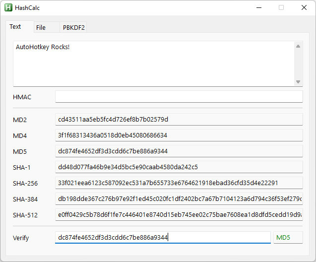

# HashCalc by jNizM
Calculate hash from string, hex or file via AutoHotkey

## Features
* Generate hash value from string or file
* Generate Password-Based Key Derivation Function 2 (PBKDF2)
* Secure-Salted function
* Verify hash

### Functions
* MD2, MD4, MD5
* SHA-1
* SHA-256, SHA-384, SHA-512
* HMAC
* PBKDF2

## Examples

## Contributing
* thanks to Bentschi for his functions CalcAddrHash(), CalcStringHash() & CalcFileHash()
* thanks to atnbueno for CalcHexHash()
* thanks to SKAN for his functions CRC() & FileCRC32()
* thanks to just me for his translated function HMAC()
* thanks to AutoHotkey Community

## Questions / Bugs / Issues
If you notice any kind of bugs or issues, report them on the [AHK Thread](https://www.autohotkey.com/boards/viewtopic.php?t=87). Same for any kind of questions.

## Copyright and License
[MIT License](LICENSE)

## Donations
[Donations are appreciated if I could help you](https://www.paypal.me/smithz)